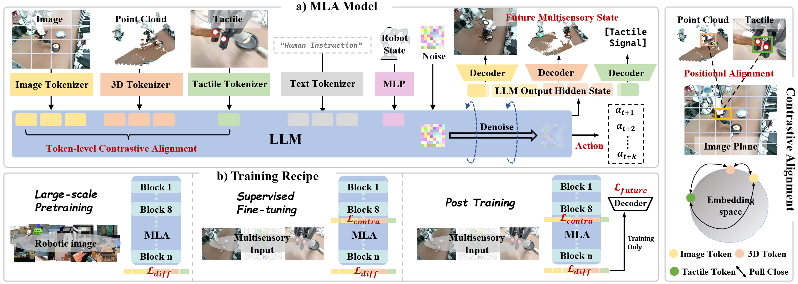

<div align="center">

# MLA: A Multisensory Language-Action Model for Multimodal Understanding and Forecasting in Robotic Manipulation


[🌐**Project Page**](https://sites.google.com/view/open-mla) | [✍️**Paper(Arxiv)**](https://github.com/ZhuoyangLiu2005/MLA) | [🎥**Demo**](https://sites.google.com/view/open-mla)

Zhuoyang Liu*, Jiaming Liu*, Jiadong Xu, Nuowei Han, Chenyang Gu, Hao Chen, Kaichen Zhou, Renrui Zhang, Kai Chin Hsieh, Kun Wu, Zhengping Che, Jian Tang, Shanghang Zhang

</div>


We introduce a multisensory language–action (MLA) model that collaboratively perceives heterogeneous sensory modalities and predicts future multisensory objectives to facilitate physical world modeling.
Specifically, to enhance perceptual representations, we propose an encoder-free multimodal alignment scheme that innovatively repurposes the large language model itself as a perception module, directly interpreting multimodal cues by aligning 2D images, 3D point clouds, and tactile tokens through positional correspondence.
To further enhance MLA’s understanding of physical dynamics, we design a future multisensory generation post-training strategy that enables MLA to reason about semantic, geometric, and interaction information, providing more robust conditions for action generation.

## ✨ News ✨

- [2025/09/30] MLA is now live on arXiv! The pre-trained checkpoint on a large-scale robotic dataset will be released soon.🚀
- [2025/09/30] The training config and script is released now!🚀

## 📦 Installation

The code is built using Python 3.10, we also recommand to use Python above Python 3.10. We require PyTorch >= 2.2.0 and CUDA >= 12.0 (It may run with lower versions, but we have not tested it).
We recommend using [Miniconda](https://docs.conda.io/en/latest/miniconda.html) and create an environment as follows:

```bash
conda create --name robo-mla python=3.10
```

Next, clone our repo and install the required packages with the following commands:

```bash
git clone https://github.com/ZhuoyangLiu2005/MLA
cd MLA
pip install -e .
```

If you need to use the traning code, please also install the [Flash Attention](https://github.com/Dao-AILab/flash-attention):

```bash
# Training additionally requires Flash-Attention 2 (https://github.com/Dao-AILab/flash-attention)
pip install packaging ninja

# Verify Ninja --> should return exit code "0"
ninja --version; echo $?

# Install Flash Attention 2
# =>> If you run into difficulty, try `pip cache remove flash_attn` first
pip install "flash-attn==2.5.5" --no-build-isolation
```

## 🧩 Framework

Our code is built based on [OpenVLA](https://github.com/openvla/openvla) and [HybridVLA](https://github.com/PKU-HMI-Lab/Hybrid-VLA) and is organized in the following framework:

- `conf`: config files for MLA training
- `scripts`: scripts for training and testing
- `training`: contains strategies for training
- `models`: contains MLA models, including backbone, diffusion, vlms, multimodel alignment components, future prediction components and mla models.
- `transformers`: from transformers lib, modified the [Llama2](https://www.llama.com/llama2/) backbone and added the multimodal contrastive learning into it.
- `util`: contains different kinds of tools funtion
- `vla`: from openvla's vla structure, including action tokenizer, etc.

## 💡Getting Started

Our model requires PIL image and text prompt as input, please refer to `scripts/test_rlbench.py` for the minimal inference, if you want to directly test on RLBench benchmark, you can refer to the following script:

```bash
# /path/to/MLA
bash scripts/test_rlbench.sh
```

## 📈Fine-tuning on RLBench Datasets

To fully fine-tune the pretrained models, we use PyTorch Fully Sharded Data Parallel(FSDP).The training script used is from [CogACT](https://github.com/microsoft/CogACT).

First, download our pretrain model, and change `--pretrained_checkpoint` to your local ckpt absolute path.

Next, create a Hugging Face user access token and export the token value. Make sure your token have right access to [llama2-7b](https://huggingface.co/meta-llama/Llama-2-7b) repo.

Then launch the training script. We use one node with 8 A100 GPUs as an example.

```
# /path/to/MLA
bash scripts/train_rlbench.sh
```

The hyperparameters in simulator can be set as follows:

|                              |Pretrain|SFT| Post Training | 
|:-----------|:-----------:|:-----------:|:-----------:|
| use_pointcloud  | false | true | true |
| use_contrastive  | false | true | true |
| use_gen                | false | false | true |
| gen_img           | false | false | true |
| use_roi                 | false | false | true/false |
| gen_pc              | false | false | true |

## 🔍Test in RLBench

We evaluated MLA in [RLBench](https://github.com/stepjam/RLBench), which based on the CoppeliaSim simulator. Install the virtual environment for testing in RLBench according to the following steps and begin your test. Thanks to the amazing work [LIFT3D](https://github.com/PKU-HMI-Lab/LIFT3D).

```bash
cd MLA

pip install git+https://github.com/moojink/dlimp_openvla@040105d256bd28866cc6620621a3d5f7b6b91b46
pip install git+https://github.com/arnoldland/openvla@5603207085d55148682e2a35b868ad77d7b42ece

export COPPELIASIM_ROOT=${HOME}/CoppeliaSim
export LD_LIBRARY_PATH=$LD_LIBRARY_PATH:$COPPELIASIM_ROOT
export QT_QPA_PLATFORM_PLUGIN_PATH=$COPPELIASIM_ROOT

wget https://downloads.coppeliarobotics.com/V4_1_0/CoppeliaSim_Edu_V4_1_0_Ubuntu20_04.tar.xz
mkdir -p $COPPELIASIM_ROOT && tar -xf CoppeliaSim_Edu_V4_1_0_Ubuntu20_04.tar.xz -C $COPPELIASIM_ROOT --strip-components 1
rm -rf CoppeliaSim_Edu_V4_1_0_Ubuntu20_04.tar.xz

git clone https://github.com/PKU-HMI-Lab/LIFT3D

cd LIFT3D/third_party/RLBench
pip install -e .
cd ../../..

cd LIFT3D
pip install -e .
cd ..
```

See the ``scripts/test_rlbench.py`` for more details.

## 📊 Run on Different Datasets

You may want to train the model on different datasets, thus you need to adjust the code to your own dataset. Here we take bridgev2 dataset as an example:

First, assume that your dataset have been fully prepared with the RLDS format. You should modify the following files:

- `vla/datasets/rlds/oxe/configs.py`

```python
# === Individual Dataset Configs ===
OXE_DATASET_CONFIGS = {
    "rlbench": {
        "image_obs_keys": {"primary": "front_image", "wrist": "wrist_image","secondary": "wrist_image_left"},
        "depth_obs_keys": {"primary": None, "secondary": None, "wrist": None},
        "state_obs_keys": ["proprio"],
        "state_encoding": StateEncoding.POS_QUAT,
        "action_encoding": ActionEncoding.EEF_POS,
    },
   # ... other dataset configs
    "bridgev2": {  # Bridge V2 Dataset
        "image_obs_keys": {"primary": "image_0", "secondary": "image_1", "wrist": None},
        "depth_obs_keys": {"primary": None, "secondary": None, "wrist": None},
        "state_obs_keys": ["proprio"],
        "state_encoding": StateEncoding.POS_EULER,
        "action_encoding": ActionEncoding.EEF_POS,
    },
    # ... other dataset configs
}
```

- `vla/datasets/rlds/oxe/mixtures.py`

```python
OXE_NAMED_MIXTURES: Dict[str, List[Tuple[str, float]]] = {
    # === Bridge V2 Dataset ===
    "bridgev2": [
        ("bridgev2", 1.0),                                    # Version of Bridge V2 in Open-X GCP Bucket
    ],
    # === RLBench Dataset ===
    "rlbench": [
         ("rlbench", 1.0),                                   # Original Version of Bridge V2 from Project Website
    ],
    # other dataset mixtures
}
```

- `vla/datasets/rlds/oxe/transforms.py`

```python
def bridge_v2_dataset_transform(trajectory: Dict[str, Any]) -> Dict[str, Any]:

    trajectory["action"] = tf.concat(
        [
            trajectory["action"][:, :6],
            binarize_gripper_actions(trajectory["action"][:, -1])[:, None],
        ],
        axis=1,
    )
    
    trajectory = relabel_bridge_actions(trajectory)
    trajectory["observation"]["EEF_state"] = trajectory["observation"]["state"][:, :6]
    trajectory["observation"]["gripper_state"] = trajectory["observation"]["state"][:, -1:]
    
    # Note: build trajectory["observation"]["proprio"] here additionally 
    # for we'll use the robot state key 'proprio' in vla/datasets/rlds/config.py
    # you can adjust the state_obs_keys to change this logic adaptively
    trajectory["observation"]["proprio"] = tf.concat(
        (
            trajectory["observation"]["EEF_state"],
            trajectory["observation"]["gripper_state"],
        ),
        axis = -1,
    )
    return trajectory

# === Registry ===
OXE_STANDARDIZATION_TRANSFORMS = {
    "bridgev2": bridge_v2_dataset_transform,
    ### other transform registries
    "rlbench": identity_transform,
}
```

- Finally, modify the training script

You only need to change the `DATA_MIX` and remember to carefully adjust the `data_root_dir`

## 🤖 Real-world Experiment

We also provide the training scripts for our real-world experiments, you can refer to these for detail:

```bash
# /path/to/MLA
bash scripts/train_franka.sh
```

Specifically, it should be mentioned that the hyperparameters can be set as follows:

|                              |Pretrain|SFT| Post Training | 
|:-----------|:-----------:|:-----------:|:-----------:|
| use_pointcloud  | false | true | true |
| use_tactile  | false | true | true |
| use_contrastive  | false | true | true |
| use_gen                | false | false | true |
| gen_img           | false | false | true |
| use_roi                 | false | false | true/false |
| gen_pc              | false | false | true |
| gen_tac              | false | false | true |

- Note: if you need to change the number of views that be loaded from the RLDS dataset, you should modify the hardcode of `load_camera_views` in `vla/datasets/datasets.py`, nor the dataset won't be successfully loaded:
  
  ```python
  class RLDSDataset(IterableDataset):
    # ......
  
        # fmt: off
        per_dataset_kwargs, weights = get_oxe_dataset_kwargs_and_weights(
            self.data_root_dir,
            mixture_spec,
            load_camera_views=("primary", "next_primary"), # "next_primary" for prediction 
            load_depth=False,
            load_proprio=False,
            load_language=True,
            load_pointcloud=use_pointcloud,
            load_tactile=use_tactile,
            action_proprio_normalization_type=NormalizationType.BOUNDS_Q99,
        )
  ```
  
  

## 📜️ License

This project is licensed under the MIT License - see the [LICENSE](LICENSE) file for details.

